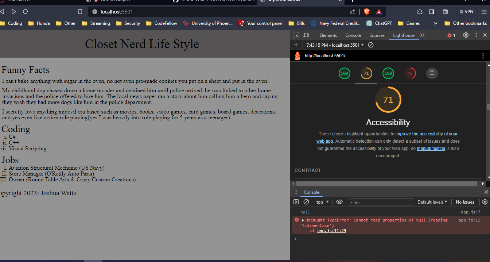
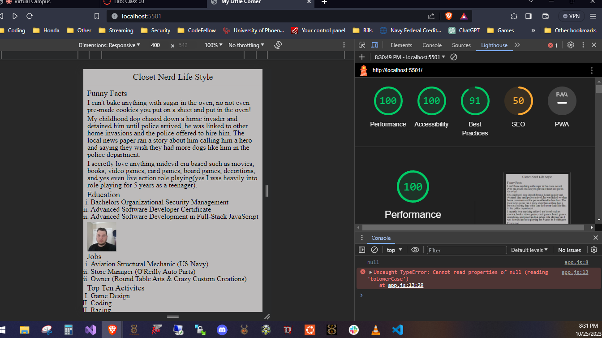

# LAB - Number 02

## Project Name about me

I build an app with a direct and powerful purpose. It does all of the things that it accomplishes well. I should describe the purpose and functionality so those that visit my README understand the app

### Author: Student/Group Name joshua watts

### Links and Resources chatgpt

* [submission PR](http://xyz.com)
* Any Links you used as reference

### Lighthouse Accessibility Report Score 71

### Reflections and Comments

My learning today was very profound, I learned a lot about the basic principles and structure of JavaScript I did not know before. I also learned I need to slow my mind down and read each detail, skimming is making me miss key details or objectives causing me to do rework and take more time in the long run. Especially when learning something new or relearning something that I have not mastered yet. I will need to make sure I review each day after I can utilize what I learned how I could implement it or what situation I would need that knowledge in.

# LAB - Number 03

## Project Name about me

I build an app with a direct and powerful purpose. It does all of the things that it accomplishes well. I should describe the purpose and functionality so those that visit my README understand the app

### Author: Student/Group Name joshua watts

### Links and Resources chatgpt

* [submission PR](http://xyz.com)
* Any Links you used as reference

### Lighthouse Accessibility Report Score 100

### Reflections and Comments

Today was a very challenging day working almost entirely in javascript for me, but I did manage to learn a lot of new techniques and foundations or building blocks about javascript that will help me going forward. Being more open minded and tryign to thinkin in simpler terms today really helped me with the javascript today, and made the day hard which would of otherwise been impossible.
